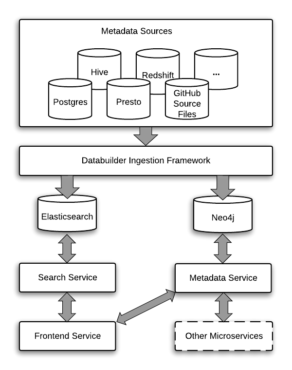
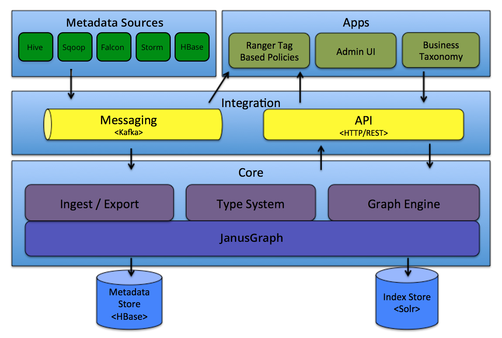
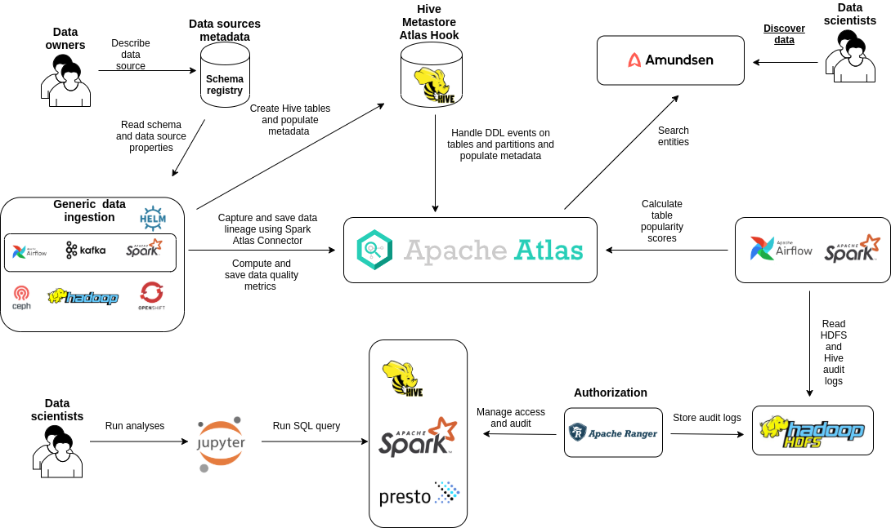
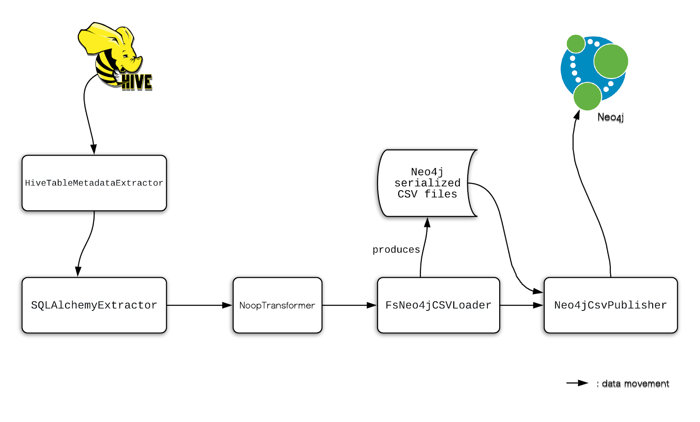
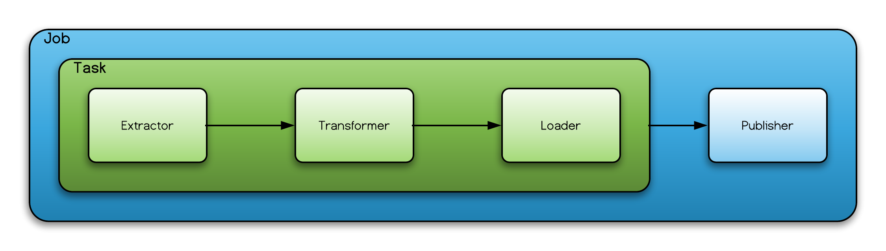

# Amundsen: concepts and integration

[Amundsen](https://www.amundsen.io/amundsen/) is a data discovery and metadata engine that provides users a tool that builds awareness on the data we have in the platform and its quality. 

3 Key pillars:
1. Augmented Data Graph: it uses a graph database(Neo4j by default) to store relas=tionships between various data assets. It brings all related metadata into this graph.

2. Intuitive User Experience: Amundsen will improve productivity of data users by indexing data resources (tables, dashboards, streams, etc.) and powering a page-rank style search based on usage patterns (e.g. highly queried tables show up earlier than less queried tables).

3. Centralized Metadata from different sources: Hive, cassandra, Presto, Airflow...

It includes three microservices (Frontend Service, Search service and Metadata service), one data ingestion library [Databuilder](https://www.amundsen.io/amundsen/databuilder/) and one common library.

In a wide Big Data ecosystem we can consider Apache Atlas as backend of Amundsen. Atlas is a Big Data metadata management and governance service. It features a wide range of out-of-the-box hooks collecting metadata from services (like Kafka, Hive, or HBase), out of the box enterprise-grade security, and REST API.

Atlas relies on HBase/Cassandra and Solr distributed data stores, enabling both storage of information and search capabilities. This way we build a comprehensive data catalog containing lineage information to identify, trace, and secure the data we have and which can be consumed through integration with Amundsen in a modern fashion.

Below, how we could use Amundsen and Atlas to do Data Discovery in an Hadoop Ecosystem.

## Installation

https://www.amundsen.io/amundsen/installation/

## Hive integration

- HiveTableMetadataExtractor

## Databuilder

https://www.amundsen.io/amundsen/databuilder/
